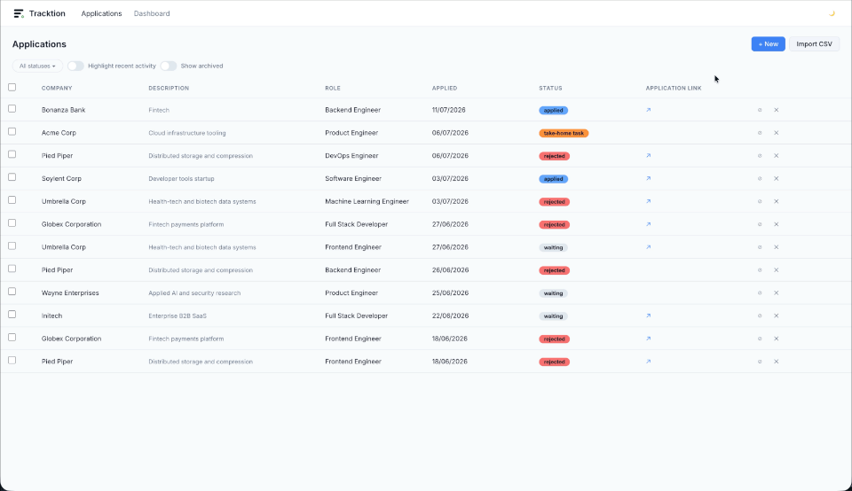
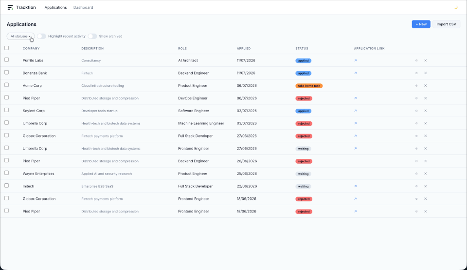
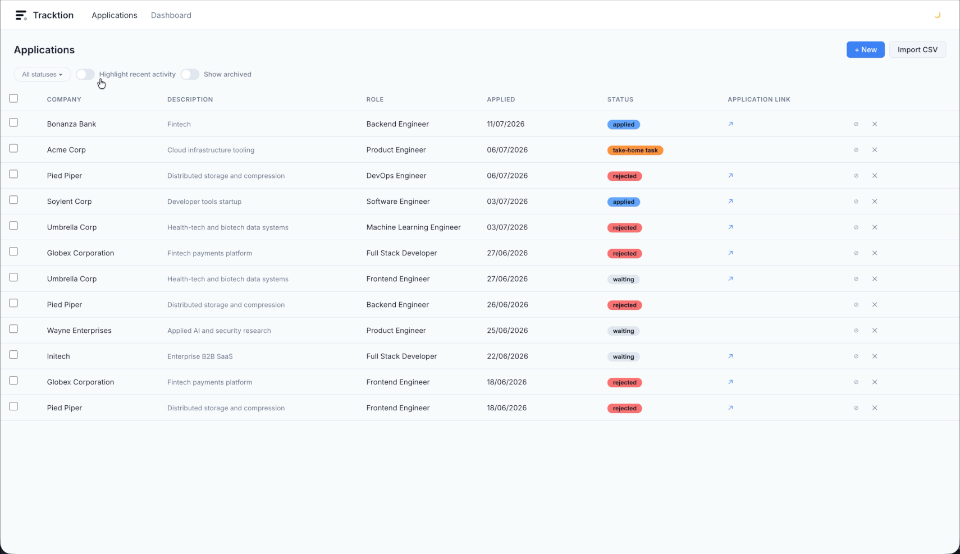
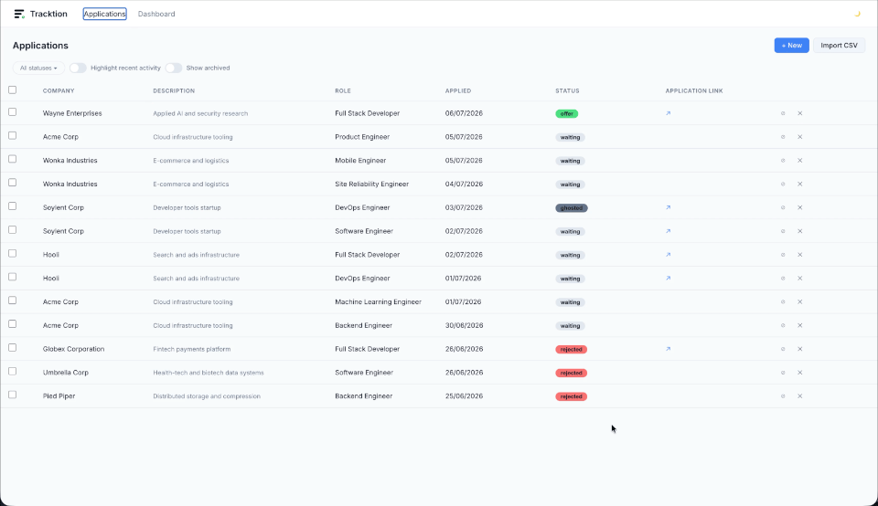
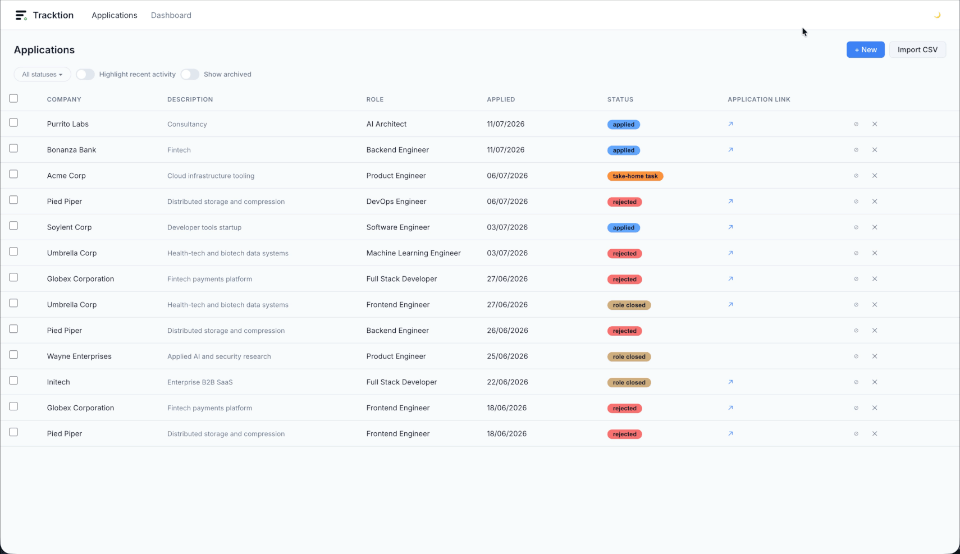

<h1 align="left">
  <picture>
    <source media="(prefers-color-scheme: dark)" srcset="frontend/src/assets/logo-dark.png">
    
  </picture>
  Tracktion
</h1>

<p align="left">
  <strong>A local-first job application tracker.</strong><br>
  Log your applications, follow status changes, and see your whole job search at a glance with nice visuals.
</p>

---

## 🎨 Features

**📈 Application tracking**
Log companies and applications, update their status changes and information, add extra notes, all in one view.
<details>
<summary>▶️ See it in action</summary>



</details>

**📊 Visual cues and dashboard**
**Highlight** active applications with a toggle to help navigate through the list


The dashboard panel includes a **funnel chart** showing how applications move through the pipeline, and a **Sankey diagram** visualizing the flow between statuses.


**🔮 CSV import**
Load your data through a guided import wizard with column mapping and a preview before saving.
<details>
<summary>▶️ See it in action</summary>

</details>

**🔗 Application link update**
A background job checks URLs of your active applications and automatically marks roles as closed if a posting disappears. The check is run once a week (skips emails and LinkedIn job ads).

**🔒 Local-first & private** 
Everything runs on your machine and is stored in a local SQLite database. No accounts, no cloud, no data sent elsewhere.

## 💻 Install and run

**Prerequisites:**
- Python 3.11+
- [uv](https://docs.astral.sh/uv/)
- Node.js 18+ with npm

Install dependencies for both apps:

```bash
cd backend && uv sync --extra dev
cd ../frontend && npm install
```

**Start the app:**
Start both servers from the repo root:

```bash
make dev
```

Open **http://localhost:5173** in your browser. Press `Ctrl+C` to stop both servers.
_Note_: The SQLite database is created automatically on first run, no setup step required.

## 🛠 Technical specs

Made with Claude Code <picture></picture>

**Tech stack**

- **Backend:** FastAPI + SQLModel + SQLite (managed with [uv](https://docs.astral.sh/uv/))
- **Frontend:** React + TypeScript + Vite


**Running the servers separately**

Backend (from `backend/`), serving the API on `http://localhost:8000`:

```bash
uv run uvicorn app.main:app --reload --timeout-graceful-shutdown 3
```

Frontend (from `frontend/`), serving the UI on `http://localhost:5173`:

```bash
npm run dev
```

The Vite dev server proxies `/api` requests to `http://localhost:8000`, so the backend needs to be running for the frontend to work.

**Configuration**

Settings can be overridden via environment variables prefixed with `TRACKTION_`, or a `.env` file in `backend/`. Defaults are fine for local use; the main ones are:

| Variable | Default | Description |
|---|---|---|
| `TRACKTION_DB_PATH` | `../data/tracktion.db` | Path to the SQLite file |
| `TRACKTION_CORS_ORIGINS` | `["http://localhost:5173", "http://localhost:3000"]` | Allowed frontend origins |

**Tests**

Backend tests run with `uv run pytest` from `backend/`.
